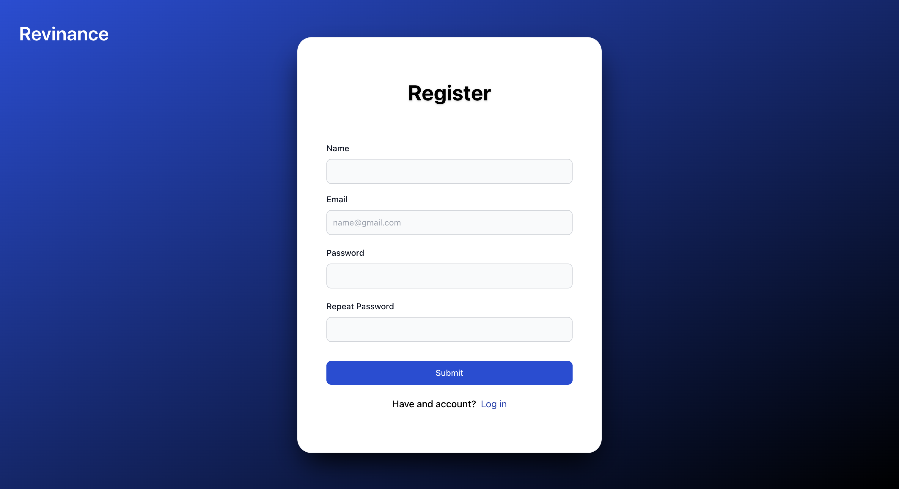
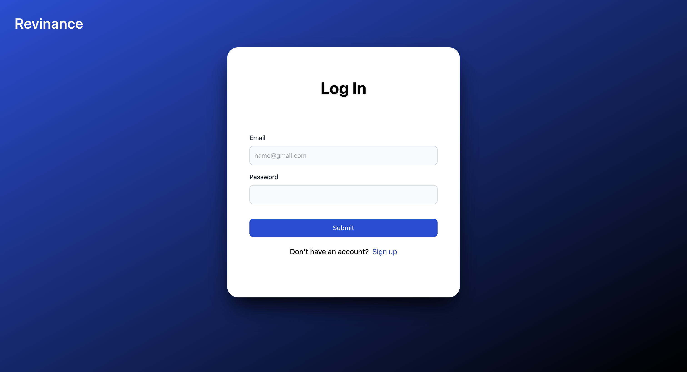
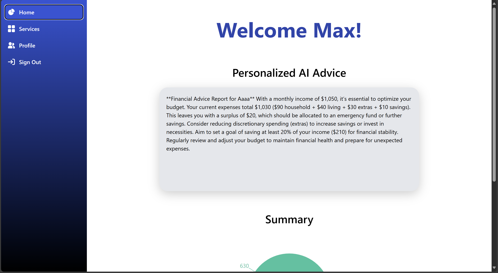
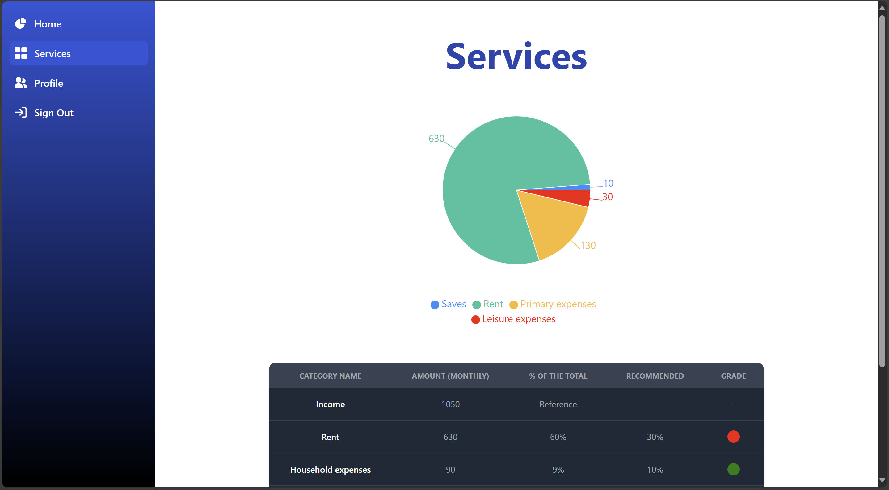
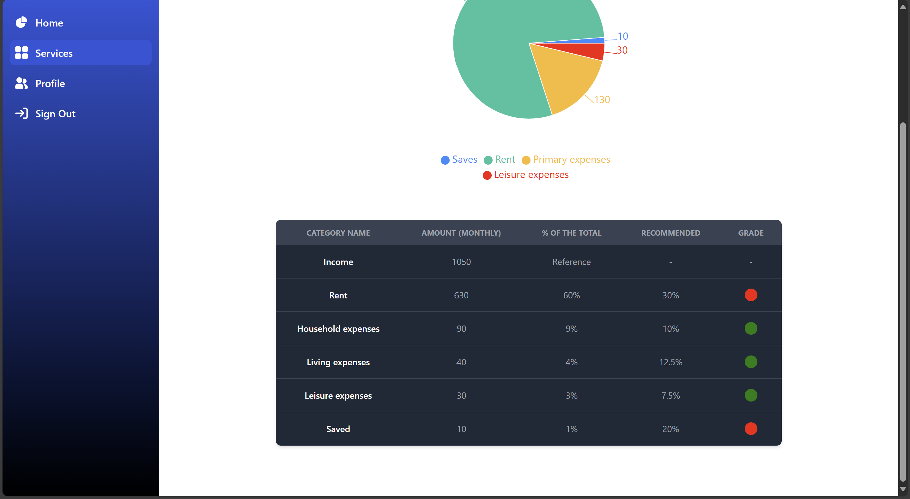
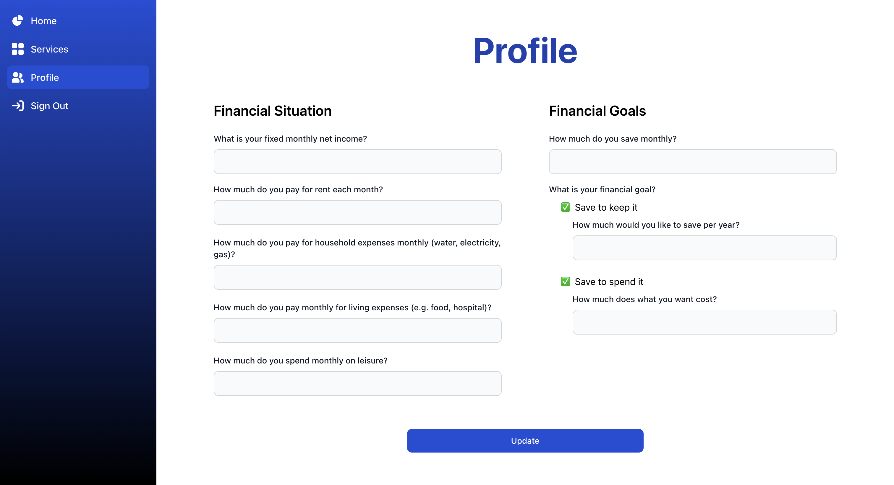
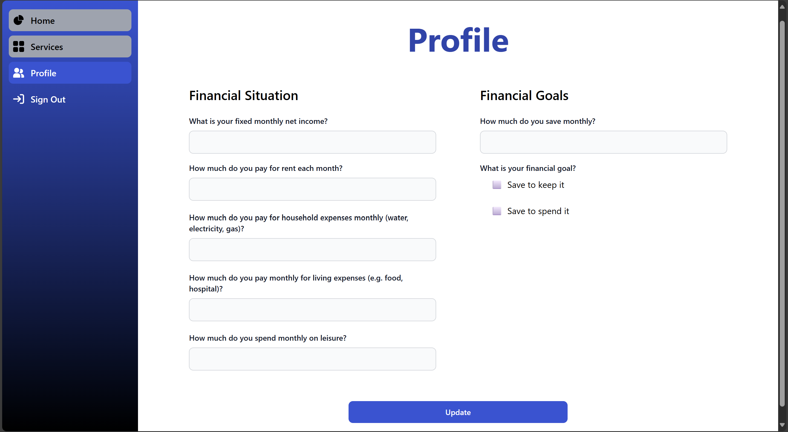

# Revinance

**Revinance** – Your personalized financial assistant.  
Built during [HackUPC 2025](https://hackupc.com/) for the **Revolut Challenge**, this AI‑powered application analyzes user data, provides insights and tailored advice to help users take control of their finances.


## Tech Stack

<table>
        <tr>
          <td><strong>Frontend:</strong></td>
          <td align="center">
            &nbsp;
            &nbsp;
            &nbsp;
            &nbsp;
          </td>
        </tr>

<tr>
            <td><strong>Backend:</strong></td>
            <td>
                &nbsp;
                &nbsp;
            </td>
        </tr>
        
<tr>
            <td><strong>AI / ML:</strong></td>
            <td>     
                &nbsp;         
                &nbsp;
                &nbsp;
        
</td>
        </tr>
        
<tr>
            <td><strong>Database & Storage:</strong></td>
            <td>
                &nbsp;
                &nbsp;
            </td>
        </tr>
      </table>


## Project Structure

```
Revinance/
├── README.md                       # Project overview
├── package.json                    # Root-level config, possibly managing the monorepo
├── package-lock.json               # Lockfile for consistent dependency installs
├── node_modules/                   # Auto-generated directory for installed dependencies (do not edit manually)

├── backend/                        # Node.js backend API and server logic
│   ├── server.js                   # Express server entry point
│   ├── node_modules/               # Auto-generated directory for installed dependencies (do not edit manually)
│   ├── package.json                # Backend dependencies (Express, etc.)
│   └── package-lock.json           # Backend dependency lock

├── public/                         # Static public files served by React
│   ├── index.html                  # Main HTML file, root of the React app
│   ├── favicon.ico                 # Site icon
│   └── robots.txt                  # Rules for web crawlers

├── src/                            # Source code for the React frontend
│   ├── index.js                    # React app entry point
│   ├── App.js                      # Main component handling routes/layout logic

│   ├── assets/                     # Static media assets
│   │   └── bg-img.jpg              # Background image used in the UI

│   ├── components/                 # Reusable UI components
│   │   └── diagram.jsx             # Component for visualizing user data or insights

│   ├── context/                    # Global state management (via React Context API)
│   │   ├── AuthContext.jsx         # Authentication state and logic
│   │   └── UserContext.jsx         # User data and shared state across components

│   ├── layouts/                    # Route-based layout wrappers
│   │   ├── PrivateLayout.jsx       # Layout for authenticated/protected routes
│   │   └── PublicLayout.jsx        # Layout for unauthenticated routes (e.g., login)

│   ├── pages/                      # Top-level routed pages
│   │   ├── Home.jsx                # Landing page (public)
│   │   ├── Login.jsx               # User login form
│   │   ├── Register.jsx            # User registration form
│   │   └── dash/                   # Authenticated dashboard area
│   │       ├── Home_.jsx           # Dashboard homepage with insights/charts
│   │       ├── Profile.jsx         # Profile management (possibly linked to AI profile)
│   │       └── Services.jsx        # Financial assistant services or AI advice tools

│   └── styles/                     # Global and modular CSS
│       ├── App.css                 # Custom styles specific to App components
│       └── index.css               # TailwindCSS directives and base styles

├── tailwind.config.js              # TailwindCSS configuration file
```


## Screenshots











## Team & Credits

- [Max Vilà Ruiz](https://github.com/MaxVilaRuiz)
- [Pau Martínez](https://github.com/taopaipau)
- [Aarón Quintanilla](https://github.com/aaronqintanilla)


## License

This project is licensed under the [MIT License](https://choosealicense.com/licenses/mit/) © License.